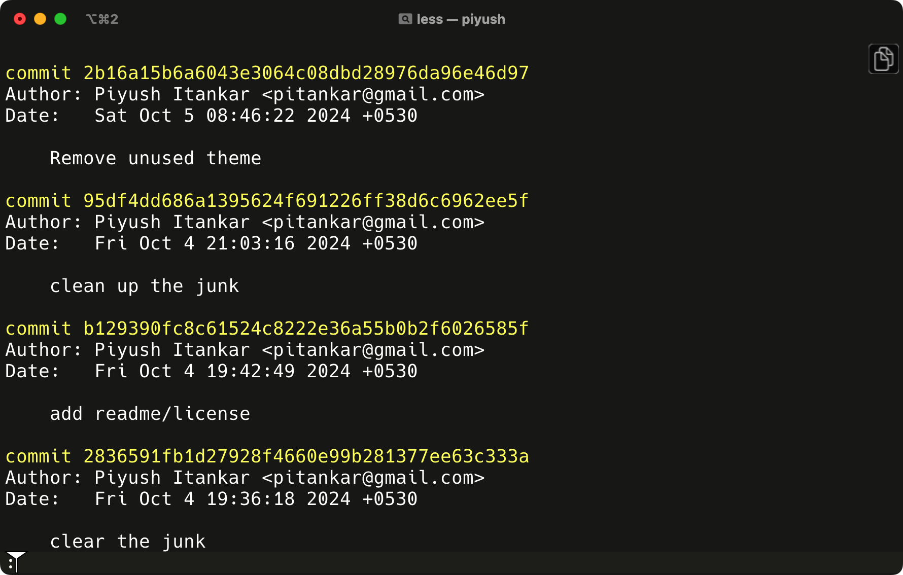

Git and Gerrit are pivotal tools in the software development industry, each serving distinct yet complementary roles that enhance collaboration, code quality, and workflow efficiency.

<!--more-->

# Git: The Backbone of Version Control

Git is a distributed version control system (VCS) that has become the de facto standard in software development. Its importance stems from its ability to manage code changes across teams, projects, and time, offering flexibility and speed that older systems like SVN or CVS couldn't match. Here's why Git is indispensable:

1. **Distributed Development**: Every developer gets a full local copy of the repository, including its history. This eliminates reliance on a central server, enabling offline work and reducing bottlenecks. For example, a developer in a remote location can commit changes without needing constant network access, syncing later when online.
1. **Branching and Merging**: Git's lightweight branching model allows teams to experiment with new features, fix bugs, or prototype ideas in isolation. Merging these branches back into the main codebase is fast and reliable. This is critical for agile workflows, where teams iterate quickly (think of a startup pushing daily updates to a web app).
1. **Collaboration at Scale**: Open-source projects like Linux (Git's origin story) or massive corporate codebases rely on Git to handle thousands of contributors. Its ability to track changes granularly ensures accountability and makes it easy to revert mistakes. For instance, if a bug slips into production, Git's bisect command can pinpoint the exact commit that introduced it.
1. **Industry Adoption**: Platforms like GitHub, GitLab, and Bitbucket-all built around Git-host millions of repositories. Companies use Git for everything from small scripts to enterprise-scale systems. It's a skill expected of every developer, making it a universal language in the industry.
1. **CI/CD Integration**: Git powers continuous integration and deployment pipelines. Automated builds, tests, and deployments trigger off Git commits or branches, enabling rapid release cycles. A company like Netflix, for example, uses Git-triggered workflows to deploy updates multiple times a day.

Git's flexibility, performance, and ubiquity make it the foundation of modern software development. Without it, managing complex, collaborative projects would be chaotic and slow.

# Gerrit: Elevating Code Quality and Governance

Gerrit is a web-based code review tool built on top of Git, designed to enforce a structured review process before changes are merged. While Git handles version control, Gerrit adds a layer of quality control and team coordination. Its importance shines in specific contexts:

1. **Mandatory Code Review**: Gerrit ensures no code enters the main repository without review. This is vital for projects where quality and stability are non-negotiable, like Google's Android or Chromium projects, both of which use Gerrit. A developer submits a change, reviewers score it (e.g., +1, +2, -1), and only approved changes get merged.
1. **Fine-Grained Access Control**: Unlike Git's basic permissions, Gerrit offers detailed control over who can review, approve, or submit changes at the repository or branch level. This is key for large organizations-imagine a bank securing sensitive financial code where only senior engineers can approve merges.
1. **Structured Workflow**: Gerrit's "patch set" system ties multiple revisions of a change together under a single Change-Id. This keeps the review process organized, even as feedback loops iterate. For example, a junior developer fixing a bug can refine their code based on senior feedback without cluttering the Git history.
1. **Knowledge Sharing**: The review process exposes team members to the codebase, fostering shared ownership. A newcomer can learn from inline comments on a complex algorithm, while veterans ensure consistency. This is especially valuable in distributed teams where face-to-face mentoring isn't possible.
1. **Scalability for Complex Projects**: Gerrit was born from the need to manage massive, interdependent codebases like Android. Its staging area for pending changes and integration with CI systems (e.g., Jenkins) ensures that only tested, reviewed code lands in production. This reduces regressions in systems with millions of lines of code.

# Industry Context and Synergy

1. Git is universal-startups, enterprises, and open-source communities all rely on it. Gerrit, however, is more niche, favored by organizations with strict governance needs (e.g., Google, Qualcomm) or large, collaborative projects. Smaller teams might opt for GitHub's pull requests instead, which are simpler but less rigid.
1. Git provides the raw power of version control; Gerrit adds discipline. Together, they create a pipeline where Git tracks every change, and Gerrit polishes those changes into production-ready code. For instance, a telecom company might use Git to manage a sprawling firmware repo, with Gerrit ensuring each update passes rigorous review.
1. In fast-paced industries like tech or gaming, Git enables rapid iteration-think Epic Games pushing Unreal Engine updates. In safety-critical fields like automotive or aerospace, Gerrit's review layer ensures compliance and reliability, as seen in projects like AUTOSAR, where code errors could cost lives.
1. Mastery of Git is a baseline hiring requirement. Familiarity with Gerrit signals experience in structured, high-stakes environments, boosting a developer's value in companies prioritizing quality over speed.
1. Git's learning curve is steep but worthwhile; its complexity (e.g., rebasing) can trip up beginners, yet its power is unmatched.
Gerrit adds overhead-some devs find it "insane" for simple projects (a sentiment echoed on forums like Reddit)-but its benefits scale with team size and project complexity. Alternatives like GitHub or GitLab are gaining ground with streamlined review tools, challenging Gerrit's niche.

Git remains the industry's heartbeat, while Gerrit thrives where precision and oversight are paramount. Together, they enable everything from scrappy indie apps to the software running your phone, proving their enduring importance. Want me to dive deeper into a specific use case?
